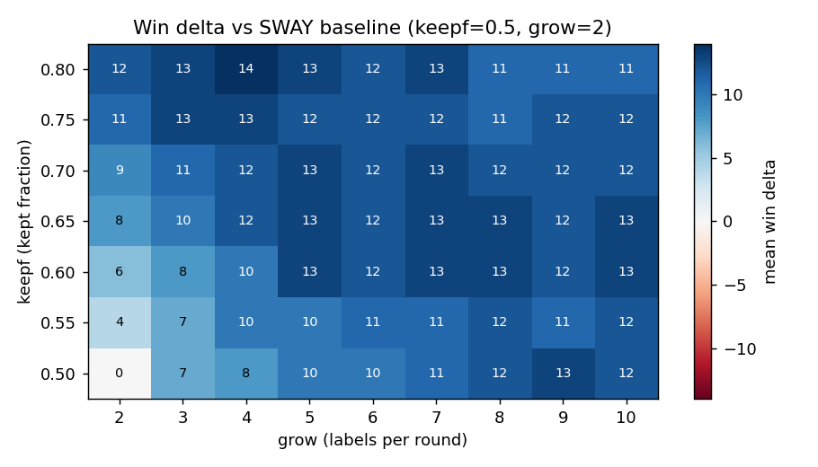

# Growing Faster Beats SWAY

`ezr2`'s sampler is a descendant of **SWAY** [Chen et al., TSE 2018,
arXiv:1608.07617]: build a large random pool, recursively split it by
far-point projection, label only a few rows per round, cull the worse half.
Two knobs control it:

- **`keepf`** — fraction of the pool kept each round (SWAY: 0.5; ezr2: 0.66).
- **`grow`**  — rows labelled per round (SWAY: 2; ezr2: 4).

SWAY was deliberately conservative: keep half, grow slowly. Is that the right
setting? We tested it.

## Method

`Growing.py`: 100,000 random draws from the grid `keepf in {0.50..0.80}` x
`grow in {2..10}`, over 20 datasets x 20 seeds (rows capped at 256). For each
draw we record the **win delta vs the SWAY baseline (0.5, 2)** on the same
dataset and seed. Because the baseline is itself a grid point, its cell
(`keepf=0.50, grow=2`) reads exactly 0; every other cell is its win gain.

## Result

```
delta win vs SWAY baseline (keepf=0.5, grow=2), N=100000

keepf\grow    2    3    4    5    6    7    8    9   10
0.80         12   13   14   13   12   13   11   11   11
0.75         11   13   13   12   12   12   11   12   12
0.70          9   11   12   13   12   13   12   12   12
0.65          8   10   12   13   12   13   13   12   13
0.60          6    8   10   13   12   13   13   12   13
0.55          4    7   10   10   11   11   12   11   12
0.50          0    7    8   10   10   11   12   13   12

best 14   worst 0   mean 11.1
```



**Every cell off the baseline is positive.** SWAY's (0.5, 2) is the single
worst point; *any* move away from it gains win, by **11 points on average**.

Reading the surface:

- **Both knobs help, and they trade off.** From the (0.50, 2) corner
  (bottom-left) you can climb by raising `grow` (along the bottom row:
  0 -> 8 -> 13) or by raising `keepf` (up the left column: 0 -> 8 -> 12).
  Either path reaches the ~12-14 plateau.
- **`grow` saturates early.** Most of its gain is in by `grow=4-5`; beyond
  that the row is flat. SWAY's `grow=2` is the one clearly starved setting --
  two rows per round is too little evidence to cull a split well.
- **`keepf` is monotone up to ~0.75.** Higher keep culls less aggressively and
  helps, easing off by 0.80 (keep too much and narrowing stalls at high grow).
- **The plateau is broad and smooth.** Across the whole interior the delta sits
  at 11-14 -- the method is *insensitive* once you leave SWAY's corner. No
  knife-edge to tune.

## Takeaways

1. **SWAY under-grows.** Its (0.5, 2) is the weakest point in this space;
   conservatism cost it ~11 win points.
2. **ezr2's defaults (0.66, 4) are well placed** -- on the plateau (~12) -- and
   already capture nearly all the available gain.
3. **Low sensitivity is the headline.** Because the surface is a smooth
   positive plateau, these knobs do not need per-dataset tuning; pick anything
   in keepf 0.65-0.80, grow 4-9 and you are near the top.

The story mirrors the active-vs-random result: the gains come from spending a
little more evidence where it matters, and the method is robust to the exact
amount.
