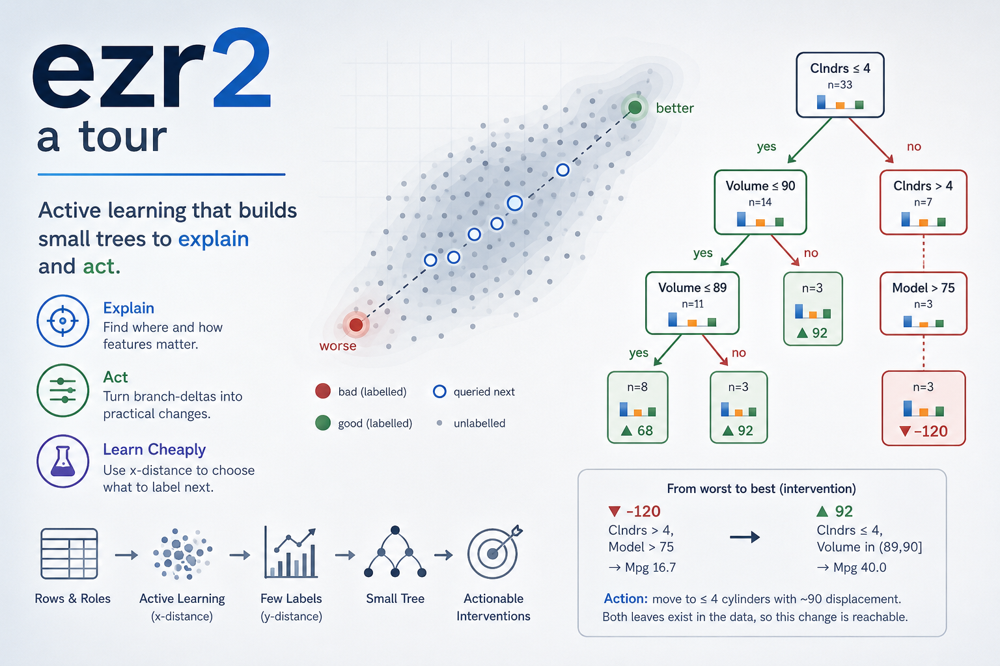

<!-- Copyright (c) 2026 Tim Menzies, MIT License -->


# aitut: six tools, one substrate

Tim Menzies <timm@ieee.org> · [timm.fyi](http://timm.fyi) · 2026-06-29 · [https://github.com/aiez/ezr2](https://github.com/aiez/ezr2)

A sequel to the [ezr2 tour](ezr2.md). That tour built one active
learner and one tree. This one shows that the *same* four classes
(`Num`, `Sym`, `Data`) plus one new sampler carry six more classic AI
tools: Naive Bayes, k-means, k-means++, simulated annealing, local
search, and differential evolution — then folds Bayes back into a new
active learner. Each tool is a thin loop; none needs a new data
structure. Read top-to-bottom; numbered traces (`[1]>`) are a live
`python3 -i aitut.py` session, outputs verbatim.

```
AUTHOR-CONFIG
audience: Python dev who has read the ezr2 tour
assumed:  ezr2's Num/Sym/Data/add, recursion, basic stats
language: Python 3
depth:    terse
tone:     K&R
prose:    65 cols   code: fenced   repl: [1]>
```

<hr>

`aitut.py` opens with `from ezr2 import *` and carries on. Every tool
below reuses ezr2's atoms — `add` to summarize, `clone` to spawn an
empty `Data`, `mid` for a centroid, `distx` for cheap x-distance,
`disty` for the expensive label. Nothing here re-implements those.

```
[1]> the.file
'../optimiz/misc_auto93.csv'
[2]> d = Data(csv(the.file)); len(d.rows)
398
```

## One new primitive: pick

Five of the six tools need to *sample* a value — a fresh centroid, a
mutant attribute, a crossover. So one function, `pick`, earns its way
into the ezr2 library itself (it is breathtakingly general: every
sampler in this file routes through it). It dispatches on column type.

```python
def pick(col, v=None):
  if is_sym(col):                  # roulette wheel over the counts
    n = sum(col.values()) * random.random()
    for k, c in col.items():
      if (n := n - c) <= 0: return k
    return k
  mu = mu_(col) if v is None or v == "?" else v   # bell around v|mu
  return mu + sd(col)*2*(random.random()+random.random()+random.random()-1.5)
```

A `Sym` is sampled by **roulette wheel** — frequent values win more
often. A `Num` is sampled by **Irwin-Hall**: three uniforms summed and
scaled make a fast Gaussian-ish bump centred on `v` (or the mean),
spread by the column's own `sd`. So mutation size is learned from the
data, not hard-coded.

```
[3]> random.seed(1); s = adds("aabbbc", Sym())
     [pick(s) for _ in range(6)]
['a', 'c', 'b', 'a', 'b', 'b']
[4]> round(pick(d.cols[1], 200), 1)   # near a Volume of 200
207.1
```

## Naive Bayes: like and likes

`like` answers one question: *how much does a column like a value?* A
`Sym` answers with a smoothed frequency; a `Num` with a Gaussian read
straight off its running `(n, mu, m2)`. No fitting pass — the `Data`
columns were already fitted, incrementally, by `add`.

```python
def like(col, v, prior):
  if v == "?": return 1
  if is_sym(col):
    return (col.get(v,0) + the.bk*prior) / (sum(col.values()) + the.bk)
  mu, s = mu_(col), sd(col)
  z = 2*s*s + TINY
  return exp(-(v - mu)**2 / z) / (z*pi)**0.5
```

`likes` is the classifier: a row's log-likelihood under a `Data`, the
sum of per-column `like`s plus a class prior. Work in log-space for
numeric stability; skip `?` and zero-probability terms.

```python
def likes(data, row, nall, nh):
  prior = (len(data.rows) + the.bk) / (nall + the.bk*nh)
  out = log(prior + TINY)
  for at in data.x:
    if (l := like(data.cols[at], row[at], prior)) > 0: out += log(l)
  return out
```

Split the rows at the median `disty` into a `good` `Data` and a `bad`
one — each is just a `clone`. Now score the first row (a heavy
8-cylinder, `disty` 0.786): Bayes is far more sure it is `bad`.

```
[5]> g = d.rows[0]; round(disty(d, g), 3)
0.786
[6]> ys = sorted(disty(d,r) for r in d.rows); m = ys[len(ys)//2]
     G = clone(d,[r for r in d.rows if disty(d,r)<=m])
     B = clone(d,[r for r in d.rows if disty(d,r)>m]); n = len(d.rows)
[7]> round(likes(G,g,n,2),2), round(likes(B,g,n,2),2)
(-49.36, -11.16)
```

`bad` wins (`-11.16 > -49.36`). Over a held-out half this good/bad
classifier scores ~0.92 (`python3 test_aitut.py bayes`). That same
good/bad question reappears at the end as an active-learning guide.

## Clustering: k-means and k-means++

A "cluster" is just a `Data`. `mids` (from ezr2) reads its centroid —
each column's `mid` (mean for a `Num`, mode for a `Sym`), cached and
rebuilt only after an add/remove.

`kmeans` is Lloyd's algorithm with the parts already built: `clone`
makes empty shells, `distx` measures membership, `add` fills a shell,
`mids` makes the next centroids. The loop is the only new code.

```python
def kmeans(data, k=8, loops=10):
  cents = [r[:] for r in some(data.rows, k)]
  out   = []
  for _ in range(loops):
    out = [clone(data, []) for _ in cents]
    for r in data.rows:
      j = min(range(len(cents)), key=lambda j: distx(data, cents[j], r))
      add(out[j], r)
    cents = [mids(c) for c in out if c.rows]
  return [c for c in out if c.rows]
```

```
[8]> random.seed(1); cl = kmeans(d, k=8)
     len(cl), sorted(len(c.rows) for c in cl)
(8, [15, 25, 30, 40, 56, 72, 79, 81])
[9]> best = min(cl, key=lambda c: sum(disty(d,r) for r in c.rows)/len(c.rows))
     [round(x,1) if isinstance(x,float) else x for x in mids(best)][:3]
[4.1, 102.7, 79.8]
```

The best cluster centres on a light 4-cylinder ~103cc engine — the
same good corner the ezr2 tree found, reached here with no labels at
all, purely from x-space structure.

`kpp` (k-means++) seeds those clusters better: pick one centre at
random, then each next centre with probability proportional to its
squared distance from the nearest chosen centre. That weighting is a
`pick` over a dict of distances — the roulette branch again.

```python
def kpp(data, k=8, few=256):
  out = [random.choice(data.rows)]
  while len(out) < k:
    t  = some(data.rows, few)
    ws = {i: min(distx(data, t[i], c) for c in out)**2 for i in range(len(t))}
    out.append(t[pick(ws)])
  return out
```

```
[10]> random.seed(1); len(kpp(d, k=5))
5
```

## Optimizers: a surrogate oracle

The next three tools *invent* candidate rows — mutants, crossovers —
that never appeared in the data. Such a row has x-values but no
y-values, so `disty` can't score it. The fix (after the EZR paper) is
a **surrogate oracle**: borrow the y of the nearest *known* row, then
score that. One nearest-neighbor lookup over a small held-out set.

```python
def oracle(data, known, row):
  near = min(known, key=lambda r: distx(data, row, r))
  for at in data.y: row[at] = near[at]
  return disty(data, row)
```

This is the honest stand-in for "run the experiment". Real domains
swap in a simulator; here a 50-row sample plays that role.

## Two (1+1) searches: annealing and local search

A `(1+1)` search holds one solution, mutates it, and maybe keeps the
mutant. The loop is identical for both algorithms; only `mutate` and
`accept` differ — so they share one body. `mutate` is a *generator*: it
may yield one candidate or a whole sweep. One extra knob, `restart`,
counts steps since the last gain (`h - imp`) and, when a search stalls
past the threshold, **resets to the initial solution** to retry from a
known footing.

```python
def oneplus1(data, known, mutate, accept, evals, restart=0):
  now0 = random.choice(data.rows)[:]
  ne0  = oracle(data, known, now0)
  now, ne, best, beste, h, imp = now0, ne0, now0, ne0, 0, 0
  while h < evals:
    for kid in mutate(now):
      e = oracle(data, known, kid); h += 1
      if accept(e, ne, h, evals): now, ne = kid, e
      if e < beste: best, beste, imp = kid, e, h     # imp = step of last gain
      if restart and h - imp > restart:              # stalled: reset-retry
        now, ne, imp = now0[:], ne0, h               # back to the initial solution
        break
      if h >= evals: break
  return best, beste
```

**Simulated annealing** mutates a random *subset* of attributes (about
`m` of them) and accepts uphill moves with a probability that cools to
zero as the budget runs out — the 1983 Metropolis rule. It never
restarts (`restart=0`); its stochastic acceptance already escapes
dead-ends.

```python
def picks(data, row, n):
  s = row[:]
  for at in some(data.x, n): s[at] = pick(data.cols[at], s[at])
  return s

def sa(data, known=None, evals=None):
  known = known or some(data.rows, the.known); evals = evals or the.evals
  n = max(1, int(the.m * len(data.x)))
  def mutate(row): yield picks(data, row, n)
  def accept(en, e, h, b):
    if en <= e: return True
    t = 1 - h/(b + 1)
    return t > 0 and random.random() < exp((e - en)/(t + TINY))
  return oneplus1(data, known, mutate, accept, evals)
```

**Local search** is purely greedy (accept only downhill), so it leans on
`restart` to escape. It mutates *one* attribute; and `p` of the time it
freezes everything but that attribute and yields a whole `tries`-long
**sweep** of its range, looking for the best setting of that one knob.

```python
def ls(data, known=None, evals=None):
  known = known or some(data.rows, the.known); evals = evals or the.evals
  def mutate(row):
    at = random.choice(data.x)               # freeze all but this one attribute
    for _ in range(the.tries if random.random() < the.p else 1):
      s = row[:]; s[at] = pick(data.cols[at], s[at]); yield s    # sweep its range
  return oneplus1(data, known, mutate, lambda en,e,h,b: en <= e, evals, the.restart)
```

```
[11]> random.seed(1); r,_ = ls(d)
      round(disty(d,r),3), round(wins(d)(r),1)
(0.105, 93.3)
```

## Differential evolution

DE is population-based: a kid is `a + f*(b-c)` for three random peers,
crossed into the parent attribute-by-attribute. Numeric columns do the
vector arithmetic; symbolic columns fall back to `pick`. One attribute
is always `keep`-ed from the parent, so a kid never strays into a total
rebuild. The peers come straight off `pop` via `some` — we don't fuss
over whether they collide (distinctness is free; `b==c` is the only
case worth avoiding, and `some` already does). Keep the kid only if the
oracle likes it better.

```python
def de(data, known=None):
  known = known or some(data.rows, the.known)
  pop = [r[:] for r in some(data.rows, the.np)]
  fit = [oracle(data, known, r) for r in pop]
  for _ in range(the.gens):
    for i in range(len(pop)):
      a, b, c = some(pop, 3)               # 3 peers, sampled straight from pop
      kid, keep = pop[i][:], random.choice(data.x)   # keep one parent attribute
      for at in data.x:
        if at != keep and random.random() < the.cr:
          col = data.cols[at]
          kid[at] = pick(col) if is_sym(col) else a[at] + the.f*(b[at]-c[at])
      if (e := oracle(data, known, kid)) < fit[i]: pop[i], fit[i] = kid, e
  i = min(range(len(pop)), key=lambda j: fit[j])
  return pop[i], fit[i]
```

```
[12]> random.seed(1); r,_ = de(d); round(disty(d,r),3)
0.075
```

All three optimizers are bounded by the best y reachable in the `known`
set; on this data they converge near the same low `disty`. The point
is the shared shape: one mutate-score-accept idea, three faces.

## Active learning, the best/rest way

The ezr2 tour's `landscape` steers by *distance* (clustering on poles).
Here is a sibling that steers by *belief*: keep two `Data`s — `best`
(the top `sqrt(N)` by `disty`) and `rest` — then label whichever
unlabelled row looks most `best`-like. The acquisition is a swappable
factory `acquire(data, best, rest, n) -> (row -> score)`, higher means
*label me next*. Two come built-in:

```python
def bayes(data, best, rest, n):          # belief: the good/bad classifier
  return lambda r: likes(best, r, n, 2) - likes(rest, r, n, 2)

def centroid(data, best, rest, n):       # distance: near best, far from rest
  bm, rm = mids(best), mids(rest)        # cached centroids (ezr2.mids)
  return lambda r: distx(data, r, rm) - distx(data, r, bm)
```

`bayes` reuses the classifier you already wrote; `centroid` reuses
`mids` and `distx`. Same loop, two lenses on "which row is promising".

The two `Data`s are never rebuilt. Each new label is folded into `best`
with `add`, and `rebalance` demotes the overflow — `add(best, worst,
-1)` subtracts a row out of `best` (the symmetry from the ezr2 tour),
then `add(rest, worst)` folds it in. No `clone`, no re-summarizing: the
`(n, mu, m2)` tuples move ±1 row at a time.

```python
def rebalance(best, rest, y):
  n = len(best.rows) + len(rest.rows)
  while len(best.rows) > int(n**0.5 + 0.5):
    worst = max(best.rows, key=y)
    add(best, worst, -1)                       # subtract worst out of best
    add(rest, worst)                           # and fold it into rest

def actives(data, acquire=bayes):
  y    = lambda r: disty(data, r)
  pool = shuffle(data.rows)
  lab  = sorted(pool[:the.start], key=y)       # warm start
  pool = pool[the.start:]
  cut  = max(1, int(len(lab)**0.5 + 0.5))
  best = clone(data, lab[:cut])                # built once ...
  rest = clone(data, lab[cut:])                # ... then only add'd to
  while len(best.rows) + len(rest.rows) < the.budget and pool:
    n     = len(best.rows) + len(rest.rows)
    guess = acquire(data, best, rest, n)
    row, *pool = sorted(pool, key=guess, reverse=True)   # most-wanted first, peel it off
    add(best, row)                             # pay one label -> best
    rebalance(best, rest, y)                   # demote, incrementally
  return sorted(best.rows + rest.rows, key=y)
```

`row, *pool = sorted(...)` is the whole acquisition step: rank the
unlabelled pool by belief, peel off the single most promising row, and
let the rest fall back into `pool` for the next round.

```
[13]> random.seed(1); got = actives(d, bayes)
      len(got), round(disty(d,got[0]),3), round(wins(d)(got[0]),1)
(50, 0.075, 100.0)
[14]> random.seed(1); got = actives(d, centroid)
      round(disty(d,got[0]),3), round(wins(d)(got[0]),1)
(0.087, 97.2)
```

Belief and distance both reach (near) the best corner on a few dozen
labels — `bayes` closes the whole median-to-best gap here, `centroid`
nearly so — each reusing code you already wrote. But one run proves
nothing. The honest comparison is `test active`, which reports the
**median win over 20 shuffles** with a `same()` verdict (ezr2's
effect-size test), so noise can't masquerade as a winner.

## Running it

The CLI lane is `test_aitut.py`, exactly like `test_ezr2.py`:
`from aitut import *`, then `main(globals())`. Tests are bare names;
`--key=val` overrides any knob (aitut's extra options merge into `the`).
The `opt` and `active` tests run 20 shuffles and print median win plus
its standard deviation — the variance *is* the result (a steady winner
beats a lucky one). The lesson of both tours: the algorithm is the
loop, the substrate is the win.

```bash
$ python3 test_aitut.py bayes
$ python3 test_aitut.py opt --evals=2000
$ python3 test_aitut.py active --budget=80
$ python3 test_aitut.py all
$ pytest test_aitut.py
```

## References

[^ezr]: T. Menzies, S. Srinivasan, *Can AI be Easy? Lessons Learned
  from the EZR.py Toolkit*, Software: Practice and Experience, 2026.
[^nb]: J. Rennie et al., *Tackling the Poor Assumptions of Naive Bayes
  Text Classifiers*, ICML 2003.
[^kpp]: D. Arthur, S. Vassilvitskii, *k-means++: The Advantages of
  Careful Seeding*, SODA 2007.
[^sa]: S. Kirkpatrick, C. Gelatt, M. Vecchi, *Optimization by Simulated
  Annealing*, Science 1983.
[^de]: R. Storn, K. Price, *Differential Evolution*, J. Global
  Optimization 1997.
