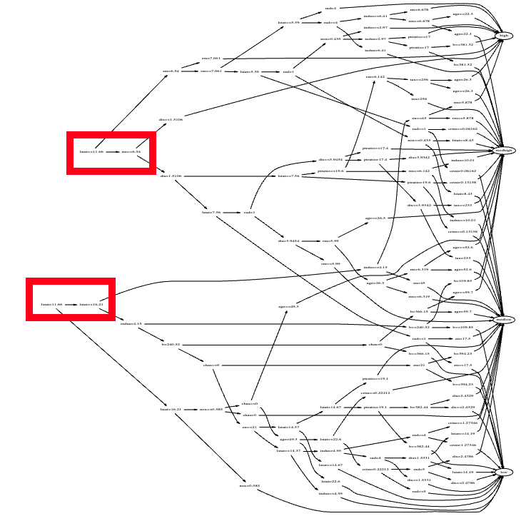

<!-- Copyright (c) 2026 Tim Menzies, MIT License -->
# ezr2: a tour

A textbook in genetic-stanza form. Read top-to-bottom: each
concept appears in build order, atoms first, call sites last.
Numbered traces (`[1]>`) are a live `python3 -i ezr2.py`
session; outputs are verbatim.

```
AUTHOR-CONFIG
audience: Python dev, new to active learning
assumed:  recursion, dicts, basic stats
language: Python 3
depth:    terse
tone:     K&R
prose:    65 cols   code: fenced   repl: [1]>
```

We want models that **explain themselves** — and explain themselves
*usefully*. Useful means the explanation suggests an **intervention**:
not just "what scored well" but "what to change to do better" (the
second rung of Pearl's ladder of causation — though here we only ever
propose changes already *seen* in the data, never claim proven cause).

Two rows show the goal. `disty` is a row's distance to the ideal goals
(0 = best); it is the *only* thing we pay to measure — everything else
is free arithmetic over the cheap x-columns.

```
  Clndrs  Volume ...  Lbs-  Acc+  Mpg+  disty
       4      90 ...  1985  21.5    40  0.075   <- good
       8     455 ...  4425    10    10  0.954   <- bad
```

Light, high-Mpg cars sit near 0; heavy guzzlers near 1. The whole game:
reach the 0.075-rows while reading `disty` for as few rows as possible
(a few dozen labels get there), then grow a small tree that says *why*
— and what to change.

## Atoms: Num and Sym

A `Num` is a 3-tuple `(n, mu, m2)` — count, running mean, and
sum of squared deviations. A `Sym` is just a `dict` of value
counts. Two summaries, one numeric, one symbolic.

```python
Sym = dict
def Num(n=0, mu=0, m2=0): return (n, mu, m2)
```

`welford` folds one value into a Num in a single pass; `sd`
reads a standard deviation back out of `m2`. No stored list.

```python
def welford(v, n, mu, m2):
  n += 1; d = v - mu; mu += d / n
  return (n, mu, m2 + d * (v - mu))
```

`adds` folds a stream into a Num. `add` dispatches on type:
Num via welford, Sym via a count bump.

```
[1]> Num()
(0, 0, 0)
[2]> c = adds([2,4,4,4,5,5,7,9]); c
(8, 5.0, 32.0)
[3]> round(mu_(c),2), round(sd(c),2)
(5.0, 2.14)
```

Two sibling pairs read a summary back, each dispatching on
type: `mid` (mean | mode) and `var` (sd | entropy). `adds`
seeds either kind — pass an empty accumulator and it is kept
(`i = Num() if i is None else i`, so a falsy `{}` survives).

```
[4]> s = adds("aabbbc", Sym()); s
{'a': 2, 'b': 3, 'c': 1}
[5]> mid(s), round(var(s), 2)
('b', 1.46)
```

## Data: rows and roles

`Data` reads a CSV. The first row is column names; their
suffixes assign roles. `Upper` = Num, `lower` = Sym. A goal
ends `+` (maximize), `-` (minimize), or `!` (klass). `X`
skips; `~` marks a sensitive column.

```python
def roles(data):
  for at, s in enumerate(data.names):
    data.cols[at] = Num() if s[0].isupper() else Sym()
    if s[-1] == "X": continue
    if s[-1] in "+-!":
      data.y += [at]; data.goal[at] = s[-1] == "+"
      if s[-1] == "!": data.klass = at
    else:
      data.x += [at]
      if s[-1] == "~": data.protect += [at]
  return data
```

So `x` are predictors, `y` are goals. `goal[at]` is `True`
when bigger is better.

```
[6]> d = Data(csv(the.file))
     len(d.rows), d.names[:3]
(398, ['Clndrs', 'Volume', 'HpX'])
[7]> d.x[:4]
[0, 1, 3, 4]
[8]> d.y, [d.names[a] for a in d.y]
([5, 6, 7], ['Lbs-', 'Acc+', 'Mpg+'])
[9]> d.rows[0]
[8, 304, 193, 70, 1, 4732, 18.5, 10]
```

## Distance: y-space and x-space

`disty` is the **label**: how far a row sits from the ideal
goals, 0 = best. Each goal is normalized to 0..1, compared to
its `goal` direction, then aggregated by a p-norm. The
`labelled` hook is where a real evaluator would fill the row.

```python
def disty(data, row, **kw):
  row = labelled(row)
  return minkowski(
    (abs(norm(data.cols[at], row[at]) - data.goal[at])
     for at in data.y if row[at] != "?"), **kw)
```

```
[10]> round(disty(d, d.rows[0]), 3)
0.786
[11]> best = min(d.rows, key=lambda r: disty(d,r))
      round(disty(d,best),3), best[:5]
(0.075, [4, 90, 48, 78, 2])
```

Labels are the cost. In the real world a label means running the
experiment, the benchmark, the survey — slow and dear. So active
learning *reflects on what it has seen* to choose what to label next,
learning only from the rows that seem to matter and ignoring noisy,
redundant ones. Done well, surprisingly few labels suffice.

The `disty` test sorts every row by its label and shows the extremes —
the good rows we are hunting, and the bad we are fleeing:

```
[12]> # python3 test_ezr2.py disty
Clndrs  Volume  HpX  Model  origin  Lbs-  Acc+  Mpg+  disty
     4      90   48     78       2  1985  21.5    40  0.075
     4      90   48     80       2  2085  21.7    40  0.087
     4      85   65     81       3  1975  19.4    40  0.087

     8     455  225     73       1  4951    11    10  0.956
```

`distx` is `disty`'s sibling over the x-columns — free to compute, no
goals consulted. Active learning leans on this: cluster in x-space,
spend labels sparingly in y-space.

```
[13]> round(distx(d, d.rows[0], best), 3)
0.785
```

## Active learning: landscape

`project` maps rows onto an east-west line through two distant
labelled poles (the y-better one is east). `landscape` then
labels `grow` rows per round, keeps the promising fraction,
and repeats until the budget (`budget-check`) is spent.

```python
def landscape(data):
  x   = lambda a,b: distx(data, a, b)
  y   = lambda r: disty(data, r)
  cap = the.budget - the.check
  pool = shuffle(data.rows)
  lab  = {}
  while len(lab) < cap and len(pool) >= 2*the.leaf:
    here, k = [], 0
    for r in pool:
      if id(r) in lab: here.append(r)
      elif k < the.grow and len(lab) < cap:
        lab[id(r)] = r; here.append(r); k += 1
    n = max(1, int((1-the.keepf)*len(pool)))
    pool = sorted(pool, key=project(here, x, y))[n:]
  return sorted(lab.values(), key=y)
```

`lab` is keyed on `id(row)` (rows are mutable lists, so
unhashable); its length *is* the budget. `wins` grades a row:
% of the gap from median to best that it closes.

```
[14]> got = landscape(d)
      len(got), round(disty(d,got[0]),3)
(40, 0.075)
[15]> round(wins(d)(got[0]), 1)
100
```

40 labels reach the best disty in the whole dataset — the entire
median-to-best gap closed.

## Trees: score, cuts, tree, show

A cut splits rows to minimize `score` — the size-weighted mean
of `var` on each side (so `sd` for numeric goals, `entropy`
for symbolic). `cuts` only yields splits leaving `leaf` rows
on **both** sides; the size guard lives here, in the selector,
so a degenerate one-row cut never wins `min`.

```python
def score(here, there):
  a, b = size(here), size(there)
  return (var(here)*a + var(there)*b) / (a + b + 1e-32)

def cuts(data,rows,at,Y,accum=Num):
  xy  = [(r[at], Y(r)) for r in rows if r[at] != "?"]
  n   = len(xy)
  tot = adds((y for _,y in xy), accum())
  cut = lambda here,k: (score(here, mix(tot,here,-1)),at,k)
  big = lambda lo: the.leaf <= lo <= n-the.leaf
  ...
```

The far side is `tot - here` via `mix(...,-1)` — one running
accumulator, no re-scan. `accum` is the goal's type: `Num` for
a regression tree (the default, with `Y=disty`), `Sym` for a
classification tree (with `Y` returning a class label).

`tree` recurses on the lowest-cost cut. `has` routes a row
(`?` goes yes-side); `if yes and no` guards the one case the
selector can't — a `?`-heavy column emptying a side. Each node
keeps `mid` — the mean of a Num goal, the mode of a Sym one.

```python
def tree(data, rows, Y=None, accum=Num, lvl=0):
  Y = Y or (lambda r: disty(data, r))
  t = o(at=None, mid=mid(adds((Y(r) for r in rows),accum())),
        n=len(rows), rows=rows)
  if len(rows) >= 2*the.leaf and lvl < the.maxd:
    if cut := min((c for at in data.x
                   for c in cuts(data,rows,at,Y,accum)),
                  default=0):
      _, at, v = cut
      col = data.cols[at]
      yes, no = [], []
      for r in rows:
        (yes if has(r,col,at,v) else no).append(r)
      if yes and no:
        t.at, t.v = at, v
        t.yes = tree(data, yes, Y, accum, lvl+1)
        t.no  = tree(data, no,  Y, accum, lvl+1)
  return t
```

`show` prints it: a `win` column, leaf size `n`, the goal
means, then the branch tests. `▲`/`▼` flag the best/worst
leaf; subtrees sort best-first.

```
[16]> t = tree(d, landscape(d)); show(d, t)
  win     n      Lbs-     Acc+     Mpg+
   -6    40  2546.850   16.468   30.000
   11    33  2325.515   16.491   32.424  Clndrs <= 4
   43    14  2036.429   17.450   35.714  |  Volume <= 90
▲  92     3  2135.000   22.300   40.000  |  |  Volume > 89
   ...
  -92     7  3590.286   16.357   18.571  Clndrs > 4
▼-120     3  3730.000   14.167   16.667  |  Model > 75
```

Light 4-cylinder cars sit at the good (`▲`) leaf — Mpg 40, fast
0–60; the heavy 8-cylinder `▼` leaf bottoms out at Mpg 16.7.

The *same* machinery builds a **classification** tree: pass a
class-label `Y` and `accum=Sym`. Now `score` reads entropy and
each node's `mid` is the majority class.

```
[17]> klass = lambda r: "good" if disty(d,r)<0.4 else "bad"
      ct = tree(d, landscape(d), klass, Sym)
      ct.mid, d.names[ct.at]
('bad', 'Volume')
```

## The payoff: branches are actions

A tree grown from a few labels is **browsable**: any row follows one
short root-to-leaf path. Each leaf is a real cluster of rows that
actually occurred in the data.



That makes the tree a *guide*, not just a report. Find the leaf you are
in, pick a better leaf, and the **delta between their branch tests is
your action** (the red boxes mark two such deltas). Because both leaves
exist in the data, the change is known to be feasible *here* — not an
invented recommendation. This is the "intervention" promised up front:
cheap to learn (a few labels), honest to act on (observed clusters
only).

## The budget rig: holdout

`landscape` searches all the data. `holdout` is the honest
generalization test: split 50:50, **landscape on the train
half only**, build a tree on those ~45 rows, then use it to
rank the unseen test half and label the top `check`.

```python
def holdout(data):
  rows  = shuffle(data.rows)
  half  = len(rows)//2
  train, test = rows[:half], rows[half:]
  got   = landscape(clone(data, train))
  t     = tree(data, got)
  top   = sorted(test,
                 key=lambda r: leaf(data,t,r))[:the.check]
  return min(top, key=lambda r: disty(data,r))
```

```
[18]> best = holdout(Data(csv(the.file)))
      round(disty(d,best),3), round(wins(d)(best),1)
(0.16, 81.6)
```

The `check` knob is **at-k trust**. A real deployment shows a human a
short list and they pick one; we grade the same way — *is a good row in
the model's top `check`?* (hit@k / top-k accuracy, from information
retrieval). `check=1` means "trust the model, apply its top pick";
larger `check` means "I am less sure — let me see a few." Often we are
checking a model some *other* team built on *other* data, and `check`
is the dial for how far we lean on it.

## Plumbing

`thing` coerces a CSV cell to int/float/bool/str. `csv`
yields rows as **lists** (so `labelled` can mutate them).
`settings` parses the module docstring's `--key ... = val`
lines into `the` — the options table *is* the config, no
duplicate defaults to drift.

```python
def settings(doc):
  pat = r"--(\w+)\s+[^=\n]*=\s*(\S+)"
  return o(**{k: thing(v)
              for k,v in re.findall(pat, doc)})

the = settings(__doc__)
```

`main` lives in the library but the `test_*` functions live in
`test_ezr2.py` (`from ezr2 import *`, then `main(globals())`).
So the library has no tests inside it; the test file is the
runnable entry point. Tests are bare names on the command line:

```bash
$ python3 test_ezr2.py landscapes --budget=80
$ python3 test_ezr2.py tree
$ pytest test_ezr2.py
```

Want a live model instead of a CSV? Override `labelled` to compute
goals on demand — `dtlz.py` drives ezr2 over the DTLZ1–7 benchmarks.

That is the whole arc: cheap x-distance to steer, expensive
y-distance to label, a tree to explain, a budget to keep
everyone honest — and branch-deltas to act on.
